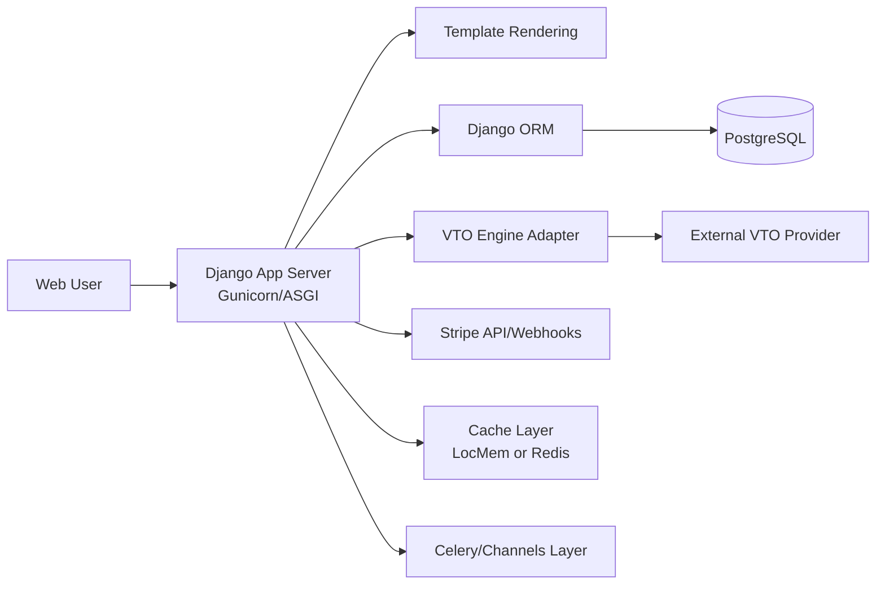

# Aura SaaS System Architecture

## 1. Architecture Summary
Aura is a modular Django platform with layered separation across presentation, business logic, domain apps, persistence, and external integrations.

## 2. Logical Layers
- **Presentation Layer**
  - Django templates and route handlers from app-specific `views.py`.
- **Application Layer**
  - App-level workflows for accounts, brands, catalog, fitting, billing, orders, inventory.
- **Domain/Data Layer**
  - Django ORM models distributed by bounded context (`apps/*/models.py`).
- **Integration Layer**
  - Stripe payments, VTO providers (local/cloud), email providers, optional Redis/Celery stack.

## 3. Runtime Component Diagram

## 4. Application Composition
- `apps.accounts`: authentication, profile, password reset OTP flow.
- `apps.brands`: brand dashboard, storefront settings, marketing operations.
- `apps.catalog`: product, variant, category, collection, reviews.
- `apps.fitting`: fit passport, photo vault, VTO session/result lifecycle.
- `apps.orders`: cart, order placement, payment verification, returns, shipping.
- `apps.billing`: subscription plans and checkout session workflow.
- `apps.inventory`: stock by location with audit logs.
- `apps.core`: global settings, CMS-like content, feature flags, notifications, audit logs.
- `api/v1`: REST exposure for brand/resources.

## 5. Security Model
- Role-based access for admin, brand owners, and customers.
- Tenant isolation through owner/brand-scoped query filtering.
- Segregated route namespaces for admin dashboards, storefronts, and APIs.
- Environment-configured secrets and webhook credentials.

## 6. Deployment Model
- **Local development**: Python virtualenv + Django runserver.
- **Containerized deployment**: Docker image with dependencies, static collection, and Gunicorn startup.
- **Cloud deployment**: Render-compatible `build.sh` and `render.yaml`.
