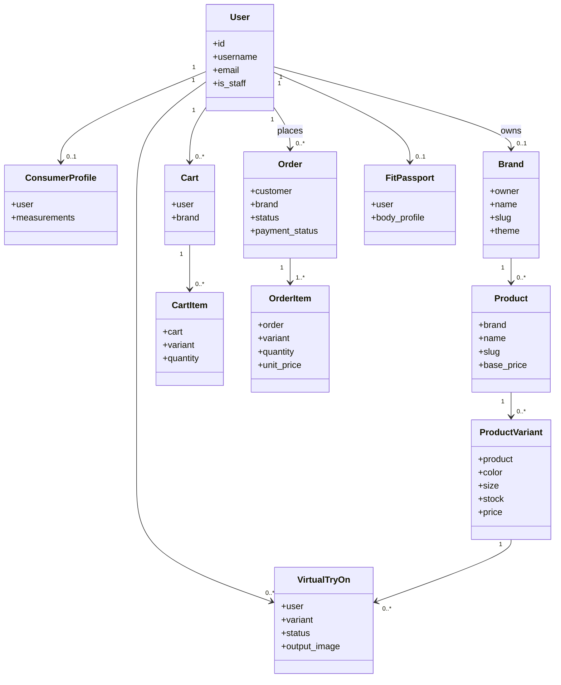
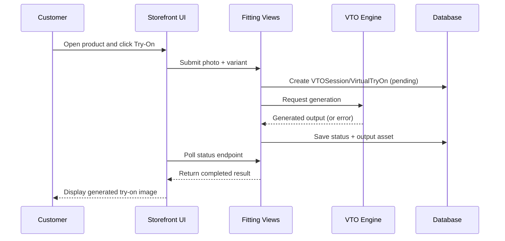

# Aura SaaS UML Diagram

## 1. Core Domain Class Diagram

```mermaid
classDiagram
    class User {
      +id
      +username
      +email
      +is_staff
    }

    class ConsumerProfile {
      +user
      +measurements
    }

    class Brand {
      +owner
      +name
      +slug
      +theme
    }

    class Product {
      +brand
      +name
      +slug
      +base_price
    }

    class ProductVariant {
      +product
      +color
      +size
      +stock
      +price
    }

    class Cart {
      +user
      +brand
    }

    class CartItem {
      +cart
      +variant
      +quantity
    }

    class Order {
      +customer
      +brand
      +status
      +payment_status
    }

    class OrderItem {
      +order
      +variant
      +quantity
      +unit_price
    }

    class FitPassport {
      +user
      +body_profile
    }

    class VirtualTryOn {
      +user
      +variant
      +status
      +output_image
    }

    User "1" --> "0..1" ConsumerProfile
    User "1" --> "0..1" Brand : owns
    Brand "1" --> "0..*" Product
    Product "1" --> "0..*" ProductVariant
    User "1" --> "0..*" Cart
    Cart "1" --> "0..*" CartItem
    User "1" --> "0..*" Order : places
    Order "1" --> "1..*" OrderItem
    User "1" --> "0..1" FitPassport
    User "1" --> "0..*" VirtualTryOn
    ProductVariant "1" --> "0..*" VirtualTryOn
```

## 2. Virtual Try-On Sequence Diagram

```mermaid
sequenceDiagram
    participant C as Customer
    participant UI as Storefront UI
    participant F as Fitting Views
    participant E as VTO Engine
    participant DB as Database

    C->>UI: Open product and click Try-On
    UI->>F: Submit photo + variant
    F->>DB: Create VTOSession/VirtualTryOn (pending)
    F->>E: Request generation
    E-->>F: Generated output (or error)
    F->>DB: Save status + output asset
    UI->>F: Poll status endpoint
    F-->>UI: Return completed result
    UI-->>C: Display generated try-on image
```
