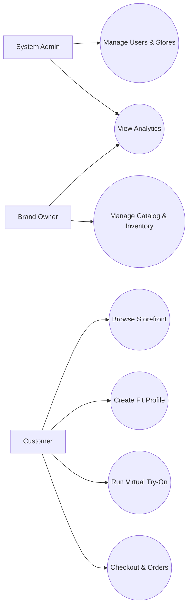
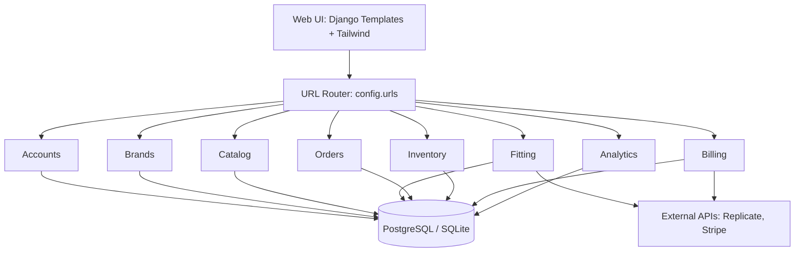
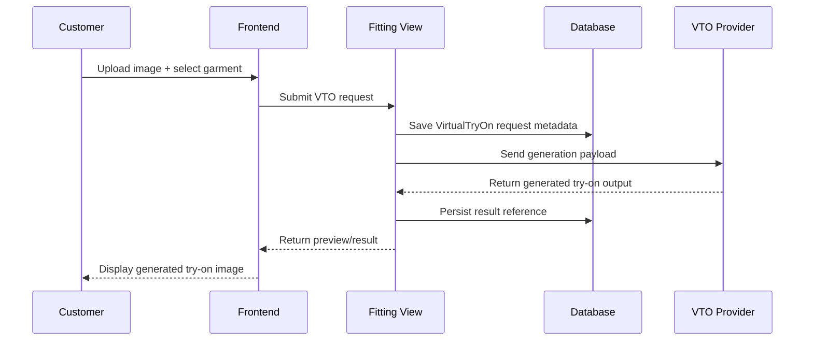

# Aura UML Diagrams

## 1. Use Case Diagram (Mermaid)

```mermaid
flowchart LR
    Admin[System Admin]
    Owner[Brand Owner]
    Customer[Customer]

    UC1((Manage Users & Stores))
    UC2((Manage Catalog & Inventory))
    UC3((Browse Storefront))
    UC4((Create Fit Profile))
    UC5((Run Virtual Try-On))
    UC6((Checkout & Orders))
    UC7((View Analytics))

    Admin --> UC1
    Admin --> UC7
    Owner --> UC2
    Owner --> UC7
    Customer --> UC3
    Customer --> UC4
    Customer --> UC5
    Customer --> UC6
```

## 2. High-Level Component Diagram (Mermaid)

```mermaid
flowchart TB
    Web[Web UI: Django Templates + Tailwind]
    URL[URL Router: config.urls]
    ACC[Accounts]
    BR[Brands]
    CAT[Catalog]
    FIT[Fitting]
    ORD[Orders]
    INV[Inventory]
    BILL[Billing]
    ANA[Analytics]
    DB[(PostgreSQL / SQLite)]
    EXT[External APIs: Replicate, Stripe]

    Web --> URL
    URL --> ACC
    URL --> BR
    URL --> CAT
    URL --> FIT
    URL --> ORD
    URL --> INV
    URL --> BILL
    URL --> ANA

    ACC --> DB
    BR --> DB
    CAT --> DB
    FIT --> DB
    ORD --> DB
    INV --> DB
    BILL --> DB
    ANA --> DB

    FIT --> EXT
    BILL --> EXT
```

## 3. VTO Request Sequence (Mermaid)

```mermaid
sequenceDiagram
    participant C as Customer
    participant UI as Frontend
    participant F as Fitting View
    participant DB as Database
    participant AI as VTO Provider

    C->>UI: Upload image + select garment
    UI->>F: Submit VTO request
    F->>DB: Save VirtualTryOn request metadata
    F->>AI: Send generation payload
    AI-->>F: Return generated try-on output
    F->>DB: Persist result reference
    F-->>UI: Return preview/result
    UI-->>C: Display generated try-on image
```
